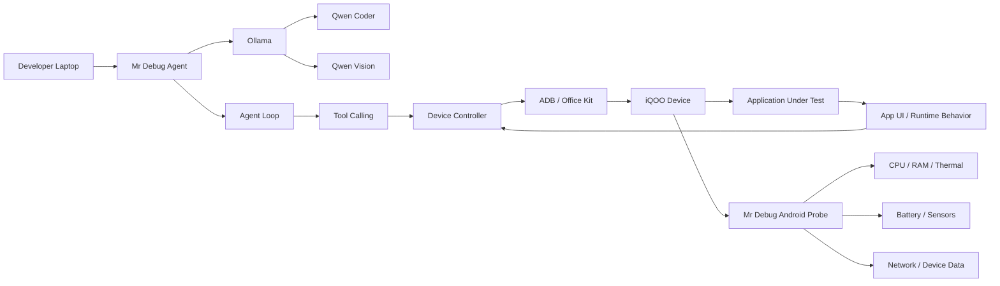

# Mr Debug

AI-powered mobile application testing and debugging for real Android/iQOO devices.

## Overview

Mr Debug is a developer-focused testing and debugging agent for mobile applications. It is designed to automate a practical loop of testing and investigation on real hardware rather than relying only on emulators.

The system is intended to work in the following flow:

TEST → OBSERVE → ANALYZE → DIAGNOSE → REPORT → RETEST

A developer builds an app on a laptop, connects a real iQOO Android phone, and runs Mr Debug locally. The agent uses Ollama to run local models, calls structured tools, and interacts with the connected device through a device-control layer built around Android debugging and automation mechanisms such as ADB, Android tooling, and device-side instrumentation.

This project is intentionally scoped as a serious hackathon prototype and a developer tool. It is not a vague "AI app tester" claim; it is a system built around real device access, telemetry capture, tool calling, reasoning, and report generation.

## Problem

Traditional mobile QA often relies on emulators or limited device automation. That can miss issues that appear only on real hardware:

- device-specific sensor behavior
- Android lifecycle edge cases
- orientation changes and configuration changes
- thermal throttling or battery-related issues
- camera and connectivity behavior on real hardware
- UI problems that are difficult to detect from hierarchy data alone

Mr Debug addresses this by combining a local reasoning agent with real-device telemetry, screenshots, logs, and Android instrumentation.

## Solution

Mr Debug runs an AI agent on the developer's laptop. The agent uses local models through Ollama and interacts with the device through a controlled tool layer. The agent is not directly controlling Android hardware; instead, it calls tool functions implemented by the device-control layer.

A typical loop is:

1. A developer gives the agent a testing objective.
2. A reasoning model interprets the objective.
3. The agent selects an available tool.
4. The tool executes against the real Android device.
5. The device produces an observation.
6. Signals such as logs, screenshots, and telemetry are collected.
7. The agent analyzes the observation.
8. The next action is chosen.
9. The loop continues until the task is complete.

## Architecture



This diagram makes the system boundaries explicit:

- Ollama: local AI runtime
- Qwen models: reasoning and vision intelligence
- Agent Loop: decision-making cycle
- Tools: actions available to the agent
- Device Controller: translates tool calls into Android operations
- ADB / Office Kit: communication and control channel
- Android Probe: device-side telemetry and instrumentation
- Application Under Test: the app being evaluated

## How the Agent Works

The agent loop is conceptually structured as follows:

1. The developer provides a testing objective.
2. The reasoning model interprets the objective and identifies required actions.
3. The model selects an available tool.
4. Mr Debug executes the tool.
5. The Android device produces an observation.
6. Mr Debug collects the observation.
7. Screenshots may be passed to a vision model.
8. Logs and telemetry are correlated with the reasoning model.
9. The model decides the next action.
10. The loop repeats until the test objective is satisfied or an issue is identified.
11. A structured debugging report is generated.

Example tools include:

- launch_app
- stop_app
- find_ui_element
- tap
- swipe
- type_text
- press_back
- press_home
- rotate_device
- take_screenshot
- analyze_screenshot
- collect_logs
- get_device_telemetry
- get_cpu_usage
- get_memory_usage
- get_thermal_status
- get_network_status
- run_camera_test
- get_app_metrics
- install_apk
- clear_app_data
- restart_app

The actual tool set depends on the implementation, available Android permissions, and the capabilities exposed by the device or probe.

## Why a Vision Model is Needed

Android UI hierarchy information is useful, but it is not always sufficient. Some interfaces are difficult to understand from metadata alone:

- custom-rendered screens
- WebViews
- canvas-based interfaces
- game-like interfaces
- animations
- rendering issues
- visual regressions
- screenshots where resource IDs or text labels are unavailable

The Qwen Vision model can analyze screenshots or relevant visual observations and return structured information such as:

- "Camera preview is black"
- "The login form is partially obscured"
- "A modal is not visible after rotation"
- "The app shows an unexpected error screen"

This is valuable for diagnosing UI state when the hierarchy or logs alone are incomplete. The vision model does not directly control the device; it provides analysis that informs the agent's next tool selection.

## Qwen Coder / Reasoning Model

The coding-oriented reasoning model is the decision-making component of the agent. It is responsible for:

- understanding developer requests
- generating test plans
- choosing relevant tools
- interpreting logs and traces
- correlating device telemetry
- reasoning about failure modes
- inspecting application source code when provided
- identifying suspicious code paths
- suggesting likely fixes
- generating structured debugging reports

The coding model is the reasoning component of the system. Tools perform the actual operations on the device or device ecosystem.

## Ollama Architecture

Mr Debug is designed to use Ollama as the local inference runtime for model execution. This keeps model access local to the developer environment when possible and avoids requiring mandatory cloud inference.

The architecture is intended to support a pair of specialized model roles:

1. Qwen Coder / coding-oriented reasoning model
   - planning
   - code understanding
   - debugging
   - interpreting logs
   - tool selection
   - suggesting fixes

2. Qwen Vision / vision-language model
   - screenshot analysis
   - UI understanding
   - visual error detection
   - screen-state diagnosis

The local model runtime provides the reasoning and vision capabilities used by the agent loop.

## Android Probe

The Android Probe is an Android companion application installed on the iQOO device before testing. Its purpose is to provide a standardized device-side interface for collecting hardware and runtime information and, where permitted, for instrumenting application state.

The Probe is not a bypass of Android security. It is a lightweight, explicit device-side observability layer that exposes data that Android APIs or device permissions legitimately allow.

Possible probe modules include:

- CPU monitor
- memory monitor
- thermal monitor
- battery monitor
- network monitor
- sensor monitor
- camera test module
- app/runtime telemetry
- device information

Example telemetry payload:

```json
{
  "cpu_usage": 72,
  "ram_used_mb": 5830,
  "battery_percent": 71,
  "thermal_status": "MODERATE",
  "network": "WIFI"
}
```

The Probe should expose structured telemetry to the agent rather than forcing the LLM to reason directly over raw Android commands.

### Probe vs ADB vs Agent

- Probe: device telemetry and instrumentation
- ADB: debugging, device control, logs, screenshots, shell access, and debug interfaces
- Mr Debug Agent: reasoning, planning, tool selection, and report generation
- Ollama: local model runtime
- Qwen Coder: reasoning / coding model
- Qwen Vision: visual understanding model

The distinction is important: the Probe exposes telemetry that Android and the device permit; ADB provides debug control and collection; the AI agent chooses what to do with that information.

## Technology Stack

| Layer | Components | Notes |
| --- | --- | --- |
| AI Runtime | Ollama | Local model runtime; can be used without mandatory cloud inference |
| LLMs | Qwen Coder / coding-focused Qwen model; Qwen Vision / vision-language model | Reasoning and visual analysis roles |
| Agent | Custom tool-calling agent loop | Decision-making and orchestration layer |
| Device Communication | ADB; Office Kit where applicable | Control and debugging channel |
| Android Device Agent | Kotlin / Android SDK | Device-side instrumentation and probe logic |
| UI Automation | Android UI hierarchy; ADB; Appium if used | Depends on implementation and device support |
| Backend | Python / FastAPI | Typical orchestration and API layer |
| Developer Dashboard | React | Optional UI for monitoring tests and reports |
| Storage | SQLite initially; PostgreSQL as optional scalable backend | Optional scaling path |
| Containerization | Docker | Useful for local deployment and repeatable environments |

This stack is intended as a practical baseline. Not every component is mandatory for every deployment, and some choices will depend on the project's maturity, device support, and required tooling.

## Example Debugging Scenario

The following example shows the intended workflow for a real-world test. This is an illustrative scenario, not a guaranteed diagnosis.

### Scenario

A developer is testing a mobile camera application and asks:

"Test whether the camera continues working after rotating the phone."

### Conceptual flow

1. Install and launch the application.
2. Find the camera screen.
3. Open the camera.
4. Capture an initial screenshot.
5. Record device telemetry.
6. Rotate the device.
7. Capture a second screenshot.
8. Check whether the preview still works.
9. Collect logs.
10. Compare before/after state.
11. Use Qwen Vision to inspect the screenshots.
12. Use Qwen Coder to correlate logs and telemetry.
13. Identify the likely failure mode.
14. Generate a structured report.

### Example report

```text
TEST FAILED

Issue:
Camera preview becomes unavailable after orientation change.

Evidence:
- Screenshot before rotation: camera preview active
- Screenshot after rotation: preview unavailable
- Camera-related error in logs
- Activity lifecycle changed during rotation

Device:
- CPU: moderate load
- RAM: elevated during preview lifecycle
- Thermal state: stable
- Network: Wi-Fi connected

Likely area:
Camera lifecycle / configuration-change handling

Suggested next step:
Inspect camera session recreation during Activity and configuration changes.
```

This report is an example, not a guaranteed diagnosis. It shows the intended reasoning flow: visual analysis, telemetry correlation, log interpretation, and structured reporting.

## On-Device AI Use Case

Mr Debug is particularly relevant for mobile applications that use local or on-device AI features. In such apps, product performance is not just about app logic; it is also about how the device handles inference,
resource pressure, and thermal behavior.

This can include correlating:

- LLM inference latency
- token generation speed
- RAM usage
- CPU usage
- GPU utilization or GPU metrics where available and exposed by the device
- thermal state
- battery state
- network conditions

A typical flow might look like this:

```text
Model loading
    ↓
RAM increases
    ↓
Inference starts
    ↓
CPU/GPU utilization increases
    ↓
Thermal state changes
    ↓
Inference latency increases
```

This helps developers investigate device-specific AI performance issues and identify whether delays are caused by inference, resource contention, thermal constraints, or app-level lifecycle problems.

Mr Debug does not automatically access private model internals unless the application or device exposes those metrics explicitly.

## Security and Privacy

Mr Debug is designed around a local-first architecture. In the default model, the developer can keep their code, logs, screenshots, and telemetry on the local machine when using local model runtimes such as Ollama.

Key considerations:

- local model inference
- no mandatory cloud LLM dependency
- explicit Android permissions required for device access
- ADB debugging authorization required for device control
- limited access according to Android's security model
- application-level instrumentation when deeper metrics are necessary

This does not guarantee absolute privacy or security. Any system involving Android debugging, device-side apps, and local AI tools must still respect the developer's environment, device authorization model, and app sandboxing rules.

## Project Status

### Current MVP

The initial minimum viable product should focus on the following components:

1. ADB device connection
2. Device Controller
3. launch / tap / swipe / type / screenshot / log tools
4. Android Probe
5. telemetry API
6. Ollama integration
7. Qwen coding / reasoning model
8. agent loop
9. screenshot analysis with Qwen Vision
10. structured debugging report

### Future Work

- automatic code patch generation
- automatic rebuild
- APK reinstall
- regression testing
- multi-device testing
- test scenario generation
- performance benchmarking
- continuous device monitoring
- team dashboards
- CI/CD integration

## Getting Started

The following setup is the conceptual starting point for a developer workstation using a real iQOO Android device.

### Prerequisites

- Python
- Node.js if required by the chosen frontend or tooling
- Android SDK / platform-tools
- ADB
- Ollama
- Android device
- USB cable or authorized wireless debugging
- iQOO phone
- Mr Debug Android Probe APK

### Setup flow

1. Install Android SDK platform tools and ensure ADB is available.
2. Enable Developer Options on the Android device.
3. Enable USB debugging.
4. Connect the iQOO phone to the laptop.
5. Verify the device is visible:

```bash
adb devices
```

6. Install the Android Probe on the device:

```bash
adb install mr-debug-probe.apk
```

7. Install Ollama and configure the desired local model runtime.
8. Pull or configure the selected Qwen models through your local Ollama setup.
9. Start Mr Debug.
10. Connect the device to the app.
11. Run a testing objective.

The actual model names and local configuration depend on the setup in the project and the models that the developer has installed locally.

## Proposed Repository Structure

This is the planned structure for the project. It may evolve as the repository grows, but this layout is a clean starting point:

```text
mr-debug/
├── agent/
│   ├── loop/
│   ├── tools/
│   ├── prompts/
│   └── models/
├── device-controller/
│   ├── adb/
│   ├── automation/
│   └── screenshots/
├── android-probe/
│   ├── app/
│   ├── telemetry/
│   ├── sensors/
│   └── transport/
├── backend/
├── dashboard/
├── tests/
├── docs/
├── docker/
├── README.md
└── LICENSE
```

## Example Workflow

A developer may ask the agent to validate a bug or run a scenario against a connected device.

```text
Developer request
    ↓
Reasoning model identifies test objective
    ↓
Tool selection
    ↓
Device actions (launch, tap, swipe, screenshot, collect logs)
    ↓
Observation capture (UI state, telemetry, screenshot)
    ↓
Vision model analyzes screenshot if needed
    ↓
Reasoning model correlates logs and telemetry
    ↓
Structured report and suggested next action
```

This is a high-level representation of the system's intended operation, not a promise of autonomous black-box device intelligence.

## Contributing

Contributions are welcome, especially in these areas:

- device controller and ADB abstractions
- Android probe telemetry collection
- screenshot and UI analysis workflows
- agent tool definitions
- structured report generation
- local model integration with Ollama
- reliability and safety around device access

Please keep changes aligned with the project's real capabilities and clearly document which features are implemented versus planned.

## License

This project does not yet include a published license. Before public release or distribution, add the appropriate open-source license for the repository.

## Notes on Scope and Reality

Mr Debug is a practical, research-oriented prototype for real-device mobile testing. It is designed to work with actual Android hardware, ADB-based control, local LLM inference, and device telemetry where those capabilities are legitimately available.

It does not claim unrestricted access to private system data, hidden app internals, or device internals that Android security and vendor restrictions prohibit. It also does not assume that every Android device exposes the same telemetry or debug interfaces.

The project is best understood as a disciplined automation and analysis system that helps developers test, observe, diagnose, and report on mobile app behavior using real hardware and explicit, permissioned instrumentation.
